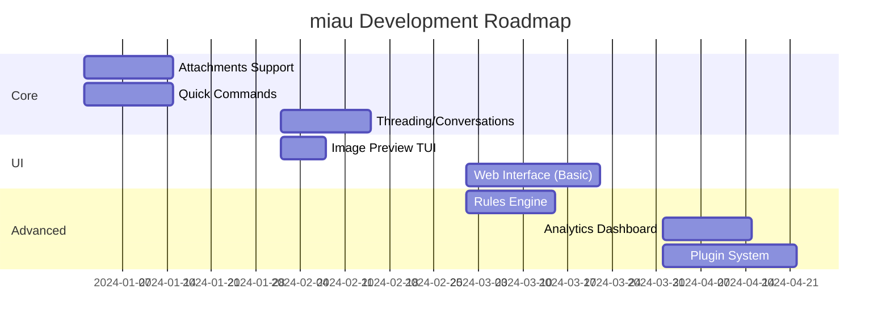

# miau - Ideas & Roadmap

This document outlines future features and improvements for miau.

## Quick Commands (Slash Commands)

Inspired by Slack/Discord, implement quick commands that can be typed directly in the AI panel or a command bar.

### AI-Powered Commands

| Command | Description | Example |
|---------|-------------|---------|
| `/dr` | **Draft Reply** - AI generates reply based on email context | `/dr formal` `/dr quick` |
| `/resume` | **Summarize** - AI summarizes selected email or thread | `/resume` |
| `/translate` | Translate email to specified language | `/translate en` `/translate pt` |
| `/tone` | Rewrite draft with different tone | `/tone professional` `/tone friendly` |
| `/tldr` | Ultra-short summary (1-2 sentences) | `/tldr` |
| `/action` | Extract action items from email | `/action` |
| `/sentiment` | Analyze email sentiment | `/sentiment` |
| `/similar` | Find similar emails in database | `/similar` |

### Quick Actions (No AI)

| Command | Description | Example |
|---------|-------------|---------|
| `/a` | Archive selected email(s) | `/a` |
| `/d` | Delete (trash) selected email(s) | `/d` |
| `/s` | Star/unstar email | `/s` |
| `/mr` | Mark as read | `/mr` |
| `/mu` | Mark as unread | `/mu` |
| `/mv` | Move to folder | `/mv Archive` |
| `/label` | Add Gmail label | `/label Important` |
| `/filter` | Quick filter current view | `/filter from:john` |
| `/goto` | Go to folder | `/goto Sent` |

### Batch Commands

| Command | Description | Example |
|---------|-------------|---------|
| `/clean` | AI suggests emails to archive/delete | `/clean newsletters` |
| `/unsubscribe` | Find unsubscribe links in selected emails | `/unsubscribe` |
| `/dedupe` | Find duplicate emails | `/dedupe` |

### Implementation

```
┌─ Command Bar ────────────────────────────────────────────────┐
│ > /dr formal                                                 │
│   ├─ /dr - Draft reply with AI                               │
│   ├─ /dr formal - Formal tone                                │
│   ├─ /dr quick - Quick/casual response                       │
│   └─ /dr followup - Follow-up message                        │
└──────────────────────────────────────────────────────────────┘
```

---

## Attachments

### Current State
- Attachments are detected (`has_attachments` flag)
- No download or viewing capability

### Proposed Features

#### Attachment Listing
```
┌─ Attachments (3) ────────────────────────────────────────────┐
│ 📎 proposal.pdf         │ 2.3 MB │ PDF Document             │
│ 📷 photo.jpg            │ 1.1 MB │ JPEG Image               │
│ 📊 data.xlsx            │ 456 KB │ Excel Spreadsheet        │
└──────────────────────────────────────────────────────────────┘
 Enter:open  s:save  S:save all  v:preview
```

#### Features
- [ ] Download attachments to local folder
- [ ] Save all attachments at once
- [ ] Open with system default app
- [ ] Attachment search across all emails
- [ ] Attachment size statistics

#### Storage
```sql
CREATE TABLE attachments (
    id INTEGER PRIMARY KEY,
    email_id INTEGER REFERENCES emails(id),
    filename TEXT NOT NULL,
    content_type TEXT,
    size INTEGER,
    content_id TEXT,  -- for inline images
    is_inline BOOLEAN DEFAULT 0,
    local_path TEXT,  -- path if downloaded
    created_at DATETIME DEFAULT CURRENT_TIMESTAMP
);
```

---

## Image Viewer in TUI ✅ IMPLEMENTADO

> **Status:** Implementado! Tecla `i` no viewer abre preview de imagens

### Terminal Image Protocols

| Protocol | Support | Quality |
|----------|---------|---------|
| **Sixel** | xterm, mlterm, foot | Good |
| **iTerm2** | iTerm2, WezTerm, Mintty | Excellent |
| **Kitty** | Kitty terminal | Excellent |
| **ASCII Art** | Universal | Basic |

### Implementation Options

1. **chafa** - Universal image-to-terminal converter
   ```bash
   chafa --size=80x24 image.jpg
   ```

2. **viu** - Rust-based terminal image viewer
   ```bash
   viu -w 80 image.jpg
   ```

3. **Go libraries**
   - `github.com/charmbracelet/x/exp/term/ansi` - ANSI sequences
   - Custom Sixel/iTerm2 implementation

### Proposed UX

```
┌─ Image Preview ──────────────────────────────────────────────┐
│                                                              │
│    ██████████████████████████████████████                    │
│    ██                                  ██                    │
│    ██    [ASCII/Sixel rendered         ██                    │
│    ██     image preview here]          ██                    │
│    ██                                  ██                    │
│    ██████████████████████████████████████                    │
│                                                              │
│  photo.jpg (1920x1080, 2.3 MB)                               │
└──────────────────────────────────────────────────────────────┘
 ←→:navigate  Enter:open full  s:save  q:close
```

---

## Multi-Platform UI

### Architecture

```
┌─────────────────────────────────────────────────────────────────┐
│                        Shared Core (Go)                         │
│  ┌─────────────┐  ┌─────────────┐  ┌─────────────┐              │
│  │   Storage   │  │    IMAP     │  │   Gmail     │              │
│  │   (SQLite)  │  │   Client    │  │    API      │              │
│  └─────────────┘  └─────────────┘  └─────────────┘              │
│  ┌─────────────┐  ┌─────────────┐  ┌─────────────┐              │
│  │  Repository │  │    SMTP     │  │    Auth     │              │
│  │   Pattern   │  │   Client    │  │   OAuth2    │              │
│  └─────────────┘  └─────────────┘  └─────────────┘              │
└─────────────────────────────────────────────────────────────────┘
                              │
         ┌────────────────────┼────────────────────┐
         │                    │                    │
         ▼                    ▼                    ▼
┌─────────────────┐  ┌─────────────────┐  ┌─────────────────┐
│   TUI (Current) │  │   Desktop App   │  │    Web App      │
│   Bubble Tea    │  │   Wails/Fyne    │  │  Go + HTMX/     │
│                 │  │                 │  │  Templ/React    │
└─────────────────┘  └─────────────────┘  └─────────────────┘
```

### Desktop Options

| Framework | Pros | Cons |
|-----------|------|------|
| **Wails** | Native look, Go + Web UI | Requires web skills |
| **Fyne** | Pure Go, cross-platform | Custom widgets needed |
| **Tauri** | Rust + Web, small binary | Not Go native |
| **Electron** | Most flexible | Heavy, not Go |

### Web App Options

| Stack | Pros | Cons |
|-------|------|------|
| **Go + Templ + HTMX** | Pure Go, minimal JS | Less interactive |
| **Go + React/Vue** | Rich UI, SPA | More complex |
| **Go + Svelte** | Lightweight, reactive | Build setup |

### Recommended: Go + Templ + HTMX

- Server-side rendering with Go templates
- HTMX for interactivity without heavy JS
- Same SQLite database
- Embedded web server in miau binary

```bash
miau serve --port 8080  # Start web interface
miau                    # Start TUI (default)
```

---

## Email Threading & Conversations

### Current State
- Emails are flat list
- No thread/conversation grouping

### Proposed Features

```
┌─ Conversation View ──────────────────────────────────────────┐
│ ▼ Re: Project Proposal (5 messages)                          │
│   ├─ John Smith          │ Initial proposal...    │ Dec 01   │
│   ├─ You                 │ Looks good, but...     │ Dec 02   │
│   ├─ John Smith          │ Updated version...     │ Dec 02   │
│   ├─ Maria (CC)          │ I agree with...        │ Dec 03   │
│   └─ You                 │ Let's proceed with...  │ Dec 03   │
│ ▶ Newsletter Weekly (1 message)                              │
│ ▼ Meeting Tomorrow (3 messages)                              │
└──────────────────────────────────────────────────────────────┘
```

#### Implementation
- Group by `message_id` / `in_reply_to` / `references` headers
- Tree structure for nested replies
- Collapse/expand threads
- Thread-level actions (archive all, mark all read)

---

## Smart Notifications & Alerts

### Priority Detection
- AI analyzes incoming emails for urgency
- Desktop notifications for high-priority
- Daily digest for low-priority

### Rules Engine
```yaml
rules:
  - name: "VIP Senders"
    condition:
      from: ["boss@company.com", "client@important.com"]
    action:
      notify: true
      label: "VIP"

  - name: "Newsletters"
    condition:
      subject_contains: ["newsletter", "digest", "weekly"]
    action:
      label: "Newsletters"
      skip_inbox: true
```

---

## Offline Mode & Sync

### Current State
- Requires IMAP connection to sync
- Local cache works offline for reading

### Proposed Features
- [ ] Queue actions when offline (archive, delete, reply)
- [ ] Sync queue when connection restored
- [ ] Conflict resolution for server changes
- [ ] Background sync daemon

```
┌─ Sync Status ────────────────────────────────────────────────┐
│ ✓ Last sync: 5 minutes ago                                   │
│ ⏳ Pending: 3 archives, 1 delete                              │
│ ⚠ Offline mode - actions queued                              │
└──────────────────────────────────────────────────────────────┘
```

---

## Calendar Integration

### Features
- Detect meeting invites (ICS attachments)
- Show calendar events in sidebar
- Accept/Decline directly from email
- Create events from email content

```
┌─ Upcoming ───────────────────────────────────────────────────┐
│ Today                                                        │
│   14:00 - Team Standup (from: calendar@google.com)           │
│   16:00 - Client Call (from: john@client.com)                │
│ Tomorrow                                                     │
│   10:00 - Project Review                                     │
└──────────────────────────────────────────────────────────────┘
```

---

## Security & Privacy

### Features to Add
- [ ] Email encryption (PGP/GPG integration)
- [ ] S/MIME support
- [ ] Phishing detection (AI-powered)
- [ ] Link safety check
- [ ] Sender verification (SPF/DKIM display)

### Phishing Detection
```
┌─ ⚠️ Security Warning ────────────────────────────────────────┐
│ This email may be suspicious:                                │
│ • Sender domain doesn't match display name                   │
│ • Contains urgency language                                  │
│ • Links point to different domains                           │
│                                                              │
│ [View Anyway] [Report Phishing] [Delete]                     │
└──────────────────────────────────────────────────────────────┘
```

---

## Analytics & Insights ✅ IMPLEMENTADO

> **Status:** Implementado no TUI (tecla `A`) e Desktop

### Email Statistics
```
┌─ Email Analytics (Last 30 days) ─────────────────────────────┐
│                                                              │
│ Received: 1,234  │  Sent: 89  │  Avg Response: 4.2h          │
│                                                              │
│ Top Senders:                                                 │
│ ████████████████████ notifications@github.com (234)          │
│ ████████████████     newsletter@medium.com (189)             │
│ ███████████          john@work.com (112)                     │
│                                                              │
│ Busiest Hours:                                               │
│     ▂▃▅▇█▇▅▃▂▁▁▁▁▂▃▅▇█▆▄▂▁                                   │
│     0  4  8  12 16 20 24                                     │
└──────────────────────────────────────────────────────────────┘
```

---

## Plugin System

### Architecture
```go
type Plugin interface {
    Name() string
    Version() string
    Init(ctx PluginContext) error

    // Hooks
    OnEmailReceived(email *Email) error
    OnEmailSent(email *Email) error
    OnCommand(cmd string, args []string) (string, error)
}
```

### Example Plugins
- **CRM Integration** - Link emails to contacts/deals
- **Task Manager** - Create tasks from emails (Todoist, Notion)
- **Slack Notifier** - Forward important emails to Slack
- **Custom AI** - Use different LLM providers

---

## Priority Matrix

### High Priority (Next Release)
1. **Multi-Select** - Space/Shift for selecting multiple emails
2. **Mouse Support** - Click, scroll, context menu
3. **Help Overlay** - Comprehensive keyboard shortcuts + tips
4. **About Screen** - Author info, links, credits
5. **Quick Commands** (`/dr`, `/resume`, `/action`)
6. **Attachments** - List, download, save
7. **Threading** - Group conversations

### Medium Priority
1. **Image Preview** - Sixel/iTerm2/Kitty terminal rendering
2. **Web Interface** - Basic HTMX version
3. **Offline Queue** - Queue actions for later sync
4. **Rules Engine** - Basic filtering rules
5. **Analytics** - Email statistics

### Low Priority (Future)
1. **Desktop App** - Wails or Fyne
2. **Calendar Integration**
3. **Plugin System**
4. **Encryption** - PGP/S/MIME

---

## Multi-Select & Mouse Support

### Current State
- Single email selection only
- No mouse interaction
- Batch operations only via AI commands

### Proposed Features

#### Multi-Select (Shift + Arrow ou Space)
```
┌─ INBOX (3 selected) ────────────────────────────────────────────┐
│ [✓] Newsletter Weekly  │ This week's digest...    │ Dec 03      │
│ [✓] Newsletter Monthly │ Monthly roundup...       │ Dec 02      │
│ [ ] John Smith         │ Meeting tomorrow         │ Dec 02      │
│ [✓] Promo Email        │ 50% off everything!      │ Dec 01      │
│ [ ] Maria Silva        │ Re: Project update       │ Dec 01      │
└─────────────────────────────────────────────────────────────────┘
 Space:select  Shift+↑↓:range  a:select all  e:archive  x:trash
```

#### Selection Methods
| Method | Action |
|--------|--------|
| `Space` | Toggle selection on current email |
| `Shift+j/k` or `Shift+↑/↓` | Extend selection up/down |
| `v` | Enter visual/select mode |
| `a` (in select mode) | Select all visible |
| `Esc` | Clear selection |

#### Batch Actions on Selection
- `e` → Archive all selected
- `x` → Trash all selected
- `m` → Mark all as read/unread
- `s` → Star/unstar all

### Mouse Support

Bubble Tea suporta mouse! Podemos habilitar:

```go
// Em tea.NewProgram()
tea.WithMouseCellMotion()
tea.WithMouseAllMotion()
```

#### Mouse Actions
| Action | Effect |
|--------|--------|
| **Click** | Select email |
| **Double-click** | Open email |
| **Ctrl+Click** | Add to selection |
| **Shift+Click** | Range selection |
| **Scroll** | Navigate list |
| **Right-click** | Context menu (future) |

#### Implementation Notes
```go
// Mouse events in Bubble Tea
case tea.MouseMsg:
    switch msg.Type {
    case tea.MouseLeft:
        // Click on email
        m.selectedIndex = m.getIndexFromY(msg.Y)
    case tea.MouseWheelUp:
        m.scrollUp()
    case tea.MouseWheelDown:
        m.scrollDown()
    }
```

#### Context Menu (Right-click)
```
┌─────────────────┐
│ 📖 Open         │
│ ✉️  Reply        │
│ ➡️  Forward      │
│ ───────────────│
│ 📁 Archive      │
│ 🗑️  Delete       │
│ ⭐ Star         │
│ ───────────────│
│ 🏷️  Add label    │
│ 📤 Move to...   │
└─────────────────┘
```

---

## Help Overlay

### Current State
- Basic footer showing some keyboard shortcuts
- No comprehensive help documentation in-app

### Proposed Features

#### Help Panel (tecla `?` ou `h`)
```
┌─ miau Help ─────────────────────────────────────────────────────┐
│                                                                 │
│  NAVIGATION                      EMAIL ACTIONS                  │
│  ───────────                     ─────────────                  │
│  j/k or ↑/↓   Navigate list      Enter   Open email            │
│  Tab          Toggle folders     e       Archive               │
│  /            Fuzzy search       x/#     Move to trash         │
│  g            Go to folder       s       Star/unstar           │
│  Home/End     First/last         m       Mark read/unread      │
│                                                                 │
│  COMPOSE                         AI ASSISTANT                   │
│  ───────                         ────────────                   │
│  c            New email          a       Open AI panel         │
│  r            Reply              Enter   Send query            │
│  R            Reply all          Esc     Close panel           │
│  f            Forward                                          │
│                                                                 │
│  GENERAL                         TIPS & TRICKS                  │
│  ───────                         ─────────────                  │
│  S            Settings           • Use AI for batch operations  │
│  d            View drafts        • "archive all from X"         │
│  ?            This help          • "draft reply to Y"           │
│  q            Quit               • Fuzzy search with partial    │
│                                    words                        │
│                                                                 │
└─────────────────────────────────────────────────────────────────┘
                              [Press any key to close]
```

#### Implementation
- Overlay component using Bubble Tea
- Categories: Navigation, Email Actions, Compose, AI, General
- Tips & Tricks section with quick examples
- Keyboard shortcut: `?` or `h`
- Dismiss with any key or `Esc`

---

## About Screen

### Proposed Features

#### About Dialog (via Settings ou tecla dedicada)
```
┌─ About miau ────────────────────────────────────────────────────┐
│                                                                 │
│                          ╭──────────╮                           │
│                          │  ┌────┐  │                           │
│                          │  │ 🐱 │  │                           │
│                          │  └────┘  │                           │
│                          ╰──────────╯                           │
│                                                                 │
│                     miau v1.0.0                                 │
│           Mail Intelligence Assistant Utility                   │
│                                                                 │
│  ───────────────────────────────────────────────────────────── │
│                                                                 │
│  Created by: André Takitani                                     │
│                                                                 │
│  🔗 LinkedIn: linkedin.com/in/takitani                          │
│  🌐 Website:  exato.digital                                     │
│  📧 GitHub:   github.com/takitani/miau                          │
│                                                                 │
│  ───────────────────────────────────────────────────────────── │
│                                                                 │
│  Built with:                                                    │
│  • Go + Bubble Tea                                              │
│  • SQLite + FTS5                                                │
│  • Claude AI                                                    │
│                                                                 │
│  License: MIT                                                   │
│                                                                 │
└─────────────────────────────────────────────────────────────────┘
                              [Press any key to close]
```

#### Features
- [ ] Version number display
- [ ] Author info with avatar (ASCII art or Sixel if supported)
- [ ] Clickable links (for terminals that support OSC 8)
- [ ] Technology stack credits
- [ ] License info
- [ ] Access via Settings menu or dedicated key

---

## Undo/Redo (Ctrl+Z Infinito)

### Proposed Features
- Histórico de ações ilimitado
- Undo para: archive, delete, move, star, mark read/unread
- Redo com Ctrl+Shift+Z ou Ctrl+Y
- Histórico persistente entre sessões (SQLite)

```
┌─ Undo History ───────────────────────────────────────────────┐
│ ↩ Archived "Newsletter Weekly"                    2 min ago  │
│ ↩ Deleted 3 emails from "Promotions"              5 min ago  │
│ ↩ Marked 12 emails as read                       10 min ago  │
│ ↩ Moved "Invoice" to "Finance" folder            15 min ago  │
└──────────────────────────────────────────────────────────────┘
 Ctrl+Z: undo last  Ctrl+Shift+Z: redo
```

---

## Temas e Customização Visual

### Theme Options
- **Dark Mode** (padrão)
- **Light Mode** - cores invertidas
- **High Contrast** - acessibilidade
- **Custom** - user-defined colors
- **Solarized** - popular coding theme
- **Dracula** - dark theme

### Font Support
- Troca de fonte via config
- Suporte a Nerd Fonts para ícones
- Tamanho de fonte (densidade de informação)

```yaml
# config.yaml
theme:
  name: "dark"  # dark, light, high-contrast, solarized, dracula
  accent_color: "#4ECDC4"

display:
  font: "JetBrains Mono"
  font_size: "normal"  # compact, normal, large
  icons: true  # requires Nerd Font
```

---

## Multi-Language / Internacionalização

### Supported Languages
- [ ] Português (pt-BR) - default
- [ ] English (en-US)
- [ ] Español (es)
- [ ] Français (fr)
- [ ] Deutsch (de)

### Implementation
```yaml
# config.yaml
language: "pt-BR"
```

### Translated Elements
- UI labels e menus
- AI prompts e responses
- Help documentation
- Error messages
- Date/time formats

---

## Tasks / Todo Integration

### Options

#### 1. Gmail Tasks API
- Sincronizar com Google Tasks
- Criar tasks a partir de emails
- Checkbox para marcar completo
- Datas de vencimento

#### 2. Internal Tasks
- Tasks locais em SQLite
- Não depende de API externa
- Privacidade total

```sql
CREATE TABLE tasks (
    id INTEGER PRIMARY KEY,
    email_id INTEGER REFERENCES emails(id),
    title TEXT NOT NULL,
    description TEXT,
    due_date DATETIME,
    completed BOOLEAN DEFAULT 0,
    priority INTEGER DEFAULT 0,
    created_at DATETIME DEFAULT CURRENT_TIMESTAMP
);
```

### Task Panel
```
┌─ Tasks (3 pending) ──────────────────────────────────────────┐
│ [ ] Reply to John about proposal          Due: Today         │
│ [ ] Send invoice to client                Due: Tomorrow      │
│ [ ] Review contracts                      Due: Dec 15        │
│ [✓] Schedule meeting with team            Completed          │
└──────────────────────────────────────────────────────────────┘
 Enter: toggle  n: new task  e: edit  d: delete  t: tasks panel
```

---

## Calendar Integration (iCal/Gmail)

### Features
- Sincronizar com Google Calendar
- Importar arquivos .ics de emails
- Mostrar eventos do dia no sidebar
- Criar eventos a partir de emails
- Accept/Decline meeting invites

### Implementation Options
1. **Google Calendar API** - Full sync
2. **iCal/CalDAV** - Standard protocol
3. **Local only** - Parse .ics attachments

```
┌─ Today ──────────────────────────────────────────────────────┐
│ 09:00 - Team Standup (Google Meet)                           │
│ 14:00 - Client Call (from email: John Smith)                 │
│ 16:30 - 1:1 with Manager                                     │
└──────────────────────────────────────────────────────────────┘
```

---

## Multi-AI Integration

### Current State
- Claude via miau TUI

### Proposed AI Providers

| Provider | Method | Pros | Cons |
|----------|--------|------|------|
| **Claude** | TUI integration | Best quality | Requires setup |
| **Gemini CLI** | Shell out | Free tier | Google account |
| **Codex CLI** | Shell out | OpenAI | Paid |
| **Ollama** | Local API | Privacy, offline | Requires GPU |
| **OpenRouter** | API | Multi-model | API key |

### Agent SDK Architecture
```
┌─────────────────────────────────────────────────────────────────┐
│                     AI Agent SDK                                │
│  ┌─────────────┐  ┌─────────────┐  ┌─────────────┐              │
│  │   Claude    │  │   Gemini    │  │   Ollama    │              │
│  │   Provider  │  │   Provider  │  │   Provider  │              │
│  └─────────────┘  └─────────────┘  └─────────────┘              │
│                         │                                       │
│                         ▼                                       │
│              ┌─────────────────────┐                            │
│              │   Unified Interface │                            │
│              │   - Chat            │                            │
│              │   - Email Draft     │                            │
│              │   - Summarize       │                            │
│              │   - Batch Ops       │                            │
│              └─────────────────────┘                            │
└─────────────────────────────────────────────────────────────────┘
```

### Config Example
```yaml
# config.yaml
ai:
  default_provider: "claude"
  providers:
    claude:
      enabled: true
    gemini:
      enabled: true
      cli_path: "/usr/local/bin/gemini"
    ollama:
      enabled: true
      model: "llama3"
      url: "http://localhost:11434"
```

### Multi-Agent Features
- Email triage por múltiplos agentes
- Fallback quando um provider falha
- Comparação de respostas
- Custo optimization (usar mais barato primeiro)

---

## Scheduled Messages (Send Later)

Send emails at a future date/time, similar to Gmail's "Schedule send" feature.

### UX Mockup
```
┌─ Compose ─────────────────────────────────────────────────────────────┐
│ To: recipient@example.com                                              │
│ Subject: Meeting follow-up                                             │
│                                                                        │
│ Hi,                                                                    │
│                                                                        │
│ Thanks for meeting today...                                            │
│                                                                        │
├────────────────────────────────────────────────────────────────────────┤
│  [s] Send now    [S] Schedule send    [Esc] Cancel                     │
└────────────────────────────────────────────────────────────────────────┘

┌─ Schedule Send ───────────────────────────────────────────────────────┐
│                                                                        │
│  Quick options:                                                        │
│  [1] Tomorrow morning (8:00 AM)                                        │
│  [2] Tomorrow afternoon (2:00 PM)                                      │
│  [3] Monday morning (8:00 AM)                                          │
│  [4] Custom date/time...                                               │
│                                                                        │
│  ┌─ Custom ─────────────────────────────────────────────────┐          │
│  │ Date: [2024-12-10]  Time: [09:30]                        │          │
│  │                                                          │          │
│  │ Scheduled: Tuesday, Dec 10, 2024 at 9:30 AM              │          │
│  └──────────────────────────────────────────────────────────┘          │
│                                                                        │
│  [Enter] Schedule    [Esc] Back                                        │
└────────────────────────────────────────────────────────────────────────┘
```

### Scheduled Messages Panel
```
┌─ Scheduled Messages (3) ──────────────────────────────────────────────┐
│                                                                        │
│  📅 Tomorrow 8:00 AM                                                   │
│     To: john@example.com                                               │
│     Subject: Project update                                            │
│                                                                        │
│  📅 Dec 10, 9:30 AM                                                    │
│     To: team@company.com                                               │
│     Subject: Weekly report                                             │
│                                                                        │
│  📅 Dec 15, 2:00 PM                                                    │
│     To: client@external.com                                            │
│     Subject: Proposal follow-up                                        │
│                                                                        │
├────────────────────────────────────────────────────────────────────────┤
│  [Enter] Edit    [d] Delete    [s] Send now    [Esc] Close             │
└────────────────────────────────────────────────────────────────────────┘
```

### Implementation Notes
- Store in SQLite `scheduled_emails` table
- Background goroutine checks every minute
- Support timezone-aware scheduling
- Notify user when sent (optional)
- Allow editing/canceling before send time
- Integrate with drafts system

### Database Schema
```sql
CREATE TABLE scheduled_emails (
    id INTEGER PRIMARY KEY,
    account_id INTEGER REFERENCES accounts(id),
    draft_id INTEGER REFERENCES drafts(id),
    scheduled_at DATETIME NOT NULL,
    timezone TEXT DEFAULT 'UTC',
    status TEXT DEFAULT 'pending',  -- pending, sent, canceled, failed
    sent_at DATETIME,
    created_at DATETIME DEFAULT CURRENT_TIMESTAMP
);
```

---

## Technical Debt

### Current Issues to Address
- [ ] Body content not indexed (only metadata synced)
- [ ] No IMAP IDLE (push notifications)
- [ ] No multi-folder operations
- [ ] Limited error recovery
- [ ] No retry logic for failed syncs

### Performance Improvements
- [ ] Virtual scrolling for large mailboxes
- [ ] Lazy loading of email bodies
- [ ] Connection pooling for IMAP
- [ ] Background sync worker
- [ ] Delta sync (only changes)

---

## Suggested Implementation Order



---

## Contributing Ideas

Have more ideas? Open an issue or submit a PR to this document!

### Idea Template
```markdown
## Feature: [Name]

**Problem:** What problem does this solve?

**Solution:** How should it work?

**UI/UX:** How would users interact with it?

**Technical:** Implementation considerations
```
