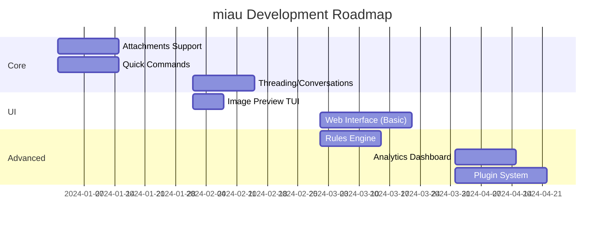

# miau - Ideas & Roadmap

This document outlines future features and improvements for miau.

## Quick Commands (Slash Commands)

Inspired by Slack/Discord, implement quick commands that can be typed directly in the AI panel or a command bar.

### AI-Powered Commands

| Command | Description | Example |
|---------|-------------|---------|
| `/dr` | **Draft Reply** - AI generates reply based on email context | `/dr formal` `/dr quick` |
| `/resume` | **Summarize** - AI summarizes selected email or thread | `/resume` |
| `/translate` | Translate email to specified language | `/translate en` `/translate pt` |
| `/tone` | Rewrite draft with different tone | `/tone professional` `/tone friendly` |
| `/tldr` | Ultra-short summary (1-2 sentences) | `/tldr` |
| `/action` | Extract action items from email | `/action` |
| `/sentiment` | Analyze email sentiment | `/sentiment` |
| `/similar` | Find similar emails in database | `/similar` |

### Quick Actions (No AI)

| Command | Description | Example |
|---------|-------------|---------|
| `/a` | Archive selected email(s) | `/a` |
| `/d` | Delete (trash) selected email(s) | `/d` |
| `/s` | Star/unstar email | `/s` |
| `/mr` | Mark as read | `/mr` |
| `/mu` | Mark as unread | `/mu` |
| `/mv` | Move to folder | `/mv Archive` |
| `/label` | Add Gmail label | `/label Important` |
| `/filter` | Quick filter current view | `/filter from:john` |
| `/goto` | Go to folder | `/goto Sent` |

### Batch Commands

| Command | Description | Example |
|---------|-------------|---------|
| `/clean` | AI suggests emails to archive/delete | `/clean newsletters` |
| `/unsubscribe` | Find unsubscribe links in selected emails | `/unsubscribe` |
| `/dedupe` | Find duplicate emails | `/dedupe` |

### Implementation

```
┌─ Command Bar ────────────────────────────────────────────────┐
│ > /dr formal                                                 │
│   ├─ /dr - Draft reply with AI                               │
│   ├─ /dr formal - Formal tone                                │
│   ├─ /dr quick - Quick/casual response                       │
│   └─ /dr followup - Follow-up message                        │
└──────────────────────────────────────────────────────────────┘
```

---

## Attachments

### Current State
- Attachments are detected (`has_attachments` flag)
- No download or viewing capability

### Proposed Features

#### Attachment Listing
```
┌─ Attachments (3) ────────────────────────────────────────────┐
│ 📎 proposal.pdf         │ 2.3 MB │ PDF Document             │
│ 📷 photo.jpg            │ 1.1 MB │ JPEG Image               │
│ 📊 data.xlsx            │ 456 KB │ Excel Spreadsheet        │
└──────────────────────────────────────────────────────────────┘
 Enter:open  s:save  S:save all  v:preview
```

#### Features
- [ ] Download attachments to local folder
- [ ] Save all attachments at once
- [ ] Open with system default app
- [ ] Attachment search across all emails
- [ ] Attachment size statistics

#### Storage
```sql
CREATE TABLE attachments (
    id INTEGER PRIMARY KEY,
    email_id INTEGER REFERENCES emails(id),
    filename TEXT NOT NULL,
    content_type TEXT,
    size INTEGER,
    content_id TEXT,  -- for inline images
    is_inline BOOLEAN DEFAULT 0,
    local_path TEXT,  -- path if downloaded
    created_at DATETIME DEFAULT CURRENT_TIMESTAMP
);
```

---

## Image Viewer in TUI

### Terminal Image Protocols

| Protocol | Support | Quality |
|----------|---------|---------|
| **Sixel** | xterm, mlterm, foot | Good |
| **iTerm2** | iTerm2, WezTerm, Mintty | Excellent |
| **Kitty** | Kitty terminal | Excellent |
| **ASCII Art** | Universal | Basic |

### Implementation Options

1. **chafa** - Universal image-to-terminal converter
   ```bash
   chafa --size=80x24 image.jpg
   ```

2. **viu** - Rust-based terminal image viewer
   ```bash
   viu -w 80 image.jpg
   ```

3. **Go libraries**
   - `github.com/charmbracelet/x/exp/term/ansi` - ANSI sequences
   - Custom Sixel/iTerm2 implementation

### Proposed UX

```
┌─ Image Preview ──────────────────────────────────────────────┐
│                                                              │
│    ██████████████████████████████████████                    │
│    ██                                  ██                    │
│    ██    [ASCII/Sixel rendered         ██                    │
│    ██     image preview here]          ██                    │
│    ██                                  ██                    │
│    ██████████████████████████████████████                    │
│                                                              │
│  photo.jpg (1920x1080, 2.3 MB)                               │
└──────────────────────────────────────────────────────────────┘
 ←→:navigate  Enter:open full  s:save  q:close
```

---

## Multi-Platform UI

### Architecture

```
┌─────────────────────────────────────────────────────────────────┐
│                        Shared Core (Go)                         │
│  ┌─────────────┐  ┌─────────────┐  ┌─────────────┐              │
│  │   Storage   │  │    IMAP     │  │   Gmail     │              │
│  │   (SQLite)  │  │   Client    │  │    API      │              │
│  └─────────────┘  └─────────────┘  └─────────────┘              │
│  ┌─────────────┐  ┌─────────────┐  ┌─────────────┐              │
│  │  Repository │  │    SMTP     │  │    Auth     │              │
│  │   Pattern   │  │   Client    │  │   OAuth2    │              │
│  └─────────────┘  └─────────────┘  └─────────────┘              │
└─────────────────────────────────────────────────────────────────┘
                              │
         ┌────────────────────┼────────────────────┐
         │                    │                    │
         ▼                    ▼                    ▼
┌─────────────────┐  ┌─────────────────┐  ┌─────────────────┐
│   TUI (Current) │  │   Desktop App   │  │    Web App      │
│   Bubble Tea    │  │   Wails/Fyne    │  │  Go + HTMX/     │
│                 │  │                 │  │  Templ/React    │
└─────────────────┘  └─────────────────┘  └─────────────────┘
```

### Desktop Options

| Framework | Pros | Cons |
|-----------|------|------|
| **Wails** | Native look, Go + Web UI | Requires web skills |
| **Fyne** | Pure Go, cross-platform | Custom widgets needed |
| **Tauri** | Rust + Web, small binary | Not Go native |
| **Electron** | Most flexible | Heavy, not Go |

### Web App Options

| Stack | Pros | Cons |
|-------|------|------|
| **Go + Templ + HTMX** | Pure Go, minimal JS | Less interactive |
| **Go + React/Vue** | Rich UI, SPA | More complex |
| **Go + Svelte** | Lightweight, reactive | Build setup |

### Recommended: Go + Templ + HTMX

- Server-side rendering with Go templates
- HTMX for interactivity without heavy JS
- Same SQLite database
- Embedded web server in miau binary

```bash
miau serve --port 8080  # Start web interface
miau                    # Start TUI (default)
```

---

## Email Threading & Conversations

### Current State
- Emails are flat list
- No thread/conversation grouping

### Proposed Features

```
┌─ Conversation View ──────────────────────────────────────────┐
│ ▼ Re: Project Proposal (5 messages)                          │
│   ├─ John Smith          │ Initial proposal...    │ Dec 01   │
│   ├─ You                 │ Looks good, but...     │ Dec 02   │
│   ├─ John Smith          │ Updated version...     │ Dec 02   │
│   ├─ Maria (CC)          │ I agree with...        │ Dec 03   │
│   └─ You                 │ Let's proceed with...  │ Dec 03   │
│ ▶ Newsletter Weekly (1 message)                              │
│ ▼ Meeting Tomorrow (3 messages)                              │
└──────────────────────────────────────────────────────────────┘
```

#### Implementation
- Group by `message_id` / `in_reply_to` / `references` headers
- Tree structure for nested replies
- Collapse/expand threads
- Thread-level actions (archive all, mark all read)

---

## Smart Notifications & Alerts

### Priority Detection
- AI analyzes incoming emails for urgency
- Desktop notifications for high-priority
- Daily digest for low-priority

### Rules Engine
```yaml
rules:
  - name: "VIP Senders"
    condition:
      from: ["boss@company.com", "client@important.com"]
    action:
      notify: true
      label: "VIP"

  - name: "Newsletters"
    condition:
      subject_contains: ["newsletter", "digest", "weekly"]
    action:
      label: "Newsletters"
      skip_inbox: true
```

---

## Offline Mode & Sync

### Current State
- Requires IMAP connection to sync
- Local cache works offline for reading

### Proposed Features
- [ ] Queue actions when offline (archive, delete, reply)
- [ ] Sync queue when connection restored
- [ ] Conflict resolution for server changes
- [ ] Background sync daemon

```
┌─ Sync Status ────────────────────────────────────────────────┐
│ ✓ Last sync: 5 minutes ago                                   │
│ ⏳ Pending: 3 archives, 1 delete                              │
│ ⚠ Offline mode - actions queued                              │
└──────────────────────────────────────────────────────────────┘
```

---

## Calendar Integration

### Features
- Detect meeting invites (ICS attachments)
- Show calendar events in sidebar
- Accept/Decline directly from email
- Create events from email content

```
┌─ Upcoming ───────────────────────────────────────────────────┐
│ Today                                                        │
│   14:00 - Team Standup (from: calendar@google.com)           │
│   16:00 - Client Call (from: john@client.com)                │
│ Tomorrow                                                     │
│   10:00 - Project Review                                     │
└──────────────────────────────────────────────────────────────┘
```

---

## Security & Privacy

### Features to Add
- [ ] Email encryption (PGP/GPG integration)
- [ ] S/MIME support
- [ ] Phishing detection (AI-powered)
- [ ] Link safety check
- [ ] Sender verification (SPF/DKIM display)

### Phishing Detection
```
┌─ ⚠️ Security Warning ────────────────────────────────────────┐
│ This email may be suspicious:                                │
│ • Sender domain doesn't match display name                   │
│ • Contains urgency language                                  │
│ • Links point to different domains                           │
│                                                              │
│ [View Anyway] [Report Phishing] [Delete]                     │
└──────────────────────────────────────────────────────────────┘
```

---

## Analytics & Insights

### Email Statistics
```
┌─ Email Analytics (Last 30 days) ─────────────────────────────┐
│                                                              │
│ Received: 1,234  │  Sent: 89  │  Avg Response: 4.2h          │
│                                                              │
│ Top Senders:                                                 │
│ ████████████████████ notifications@github.com (234)          │
│ ████████████████     newsletter@medium.com (189)             │
│ ███████████          john@work.com (112)                     │
│                                                              │
│ Busiest Hours:                                               │
│     ▂▃▅▇█▇▅▃▂▁▁▁▁▂▃▅▇█▆▄▂▁                                   │
│     0  4  8  12 16 20 24                                     │
└──────────────────────────────────────────────────────────────┘
```

---

## Plugin System

### Architecture
```go
type Plugin interface {
    Name() string
    Version() string
    Init(ctx PluginContext) error

    // Hooks
    OnEmailReceived(email *Email) error
    OnEmailSent(email *Email) error
    OnCommand(cmd string, args []string) (string, error)
}
```

### Example Plugins
- **CRM Integration** - Link emails to contacts/deals
- **Task Manager** - Create tasks from emails (Todoist, Notion)
- **Slack Notifier** - Forward important emails to Slack
- **Custom AI** - Use different LLM providers

---

## Priority Matrix

### High Priority (Next Release)
1. **Quick Commands** (`/dr`, `/resume`, `/action`)
2. **Attachments** - List, download, save
3. **Image Preview** - Basic terminal rendering
4. **Threading** - Group conversations

### Medium Priority
1. **Web Interface** - Basic HTMX version
2. **Offline Queue** - Queue actions for later sync
3. **Rules Engine** - Basic filtering rules
4. **Analytics** - Email statistics

### Low Priority (Future)
1. **Desktop App** - Wails or Fyne
2. **Calendar Integration**
3. **Plugin System**
4. **Encryption** - PGP/S/MIME

---

## Technical Debt

### Current Issues to Address
- [ ] Body content not indexed (only metadata synced)
- [ ] No IMAP IDLE (push notifications)
- [ ] No multi-folder operations
- [ ] Limited error recovery
- [ ] No retry logic for failed syncs

### Performance Improvements
- [ ] Virtual scrolling for large mailboxes
- [ ] Lazy loading of email bodies
- [ ] Connection pooling for IMAP
- [ ] Background sync worker
- [ ] Delta sync (only changes)

---

## Suggested Implementation Order



---

## Contributing Ideas

Have more ideas? Open an issue or submit a PR to this document!

### Idea Template
```markdown
## Feature: [Name]

**Problem:** What problem does this solve?

**Solution:** How should it work?

**UI/UX:** How would users interact with it?

**Technical:** Implementation considerations
```
