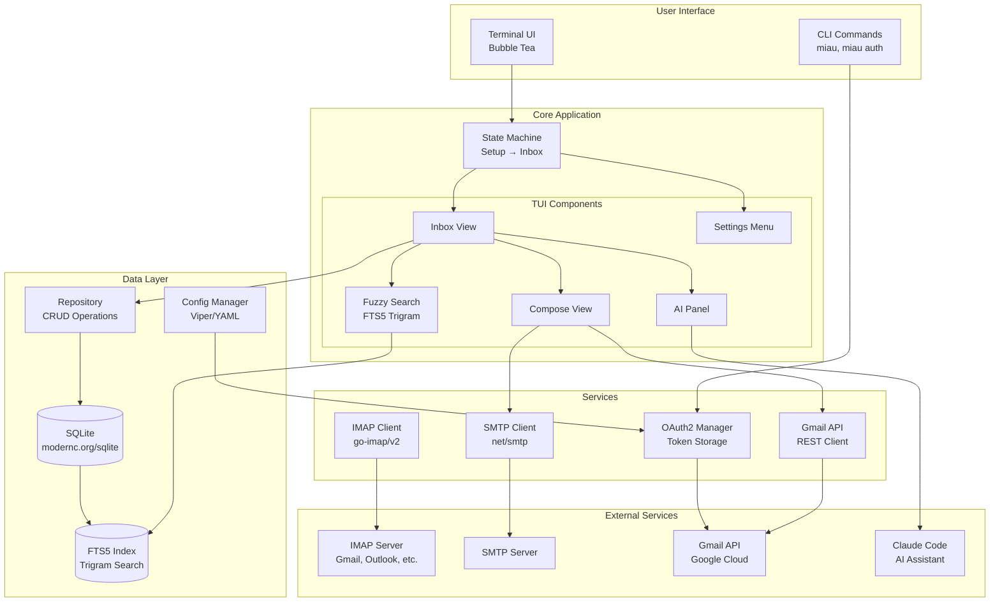
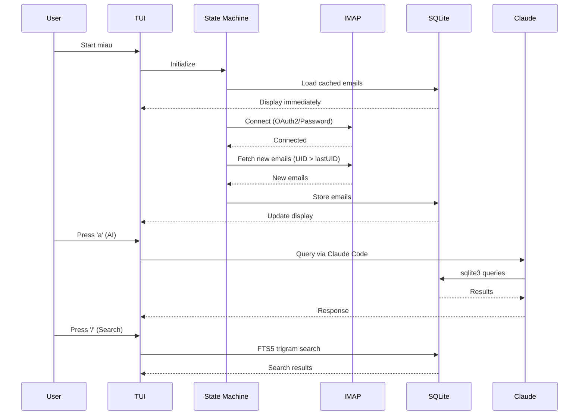
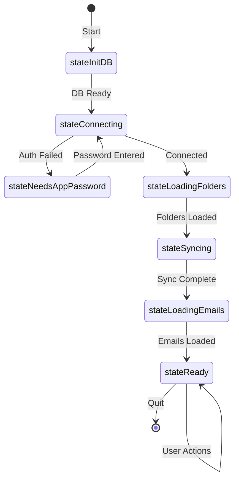

# miau Architecture

## System Overview

## Data Flow

## Component Responsibilities

### TUI Layer (`internal/tui/`)
- **inbox/** - Main email interface with state machine
- **setup/** - First-run configuration wizard

### Service Layer (`internal/`)
- **imap/** - IMAP protocol wrapper (go-imap/v2)
- **smtp/** - Email sending via SMTP
- **gmail/** - Gmail REST API client
- **auth/** - OAuth2 authentication flow

### Data Layer (`internal/storage/`)
- **db.go** - SQLite initialization, schema, migrations
- **models.go** - Data structures (Email, Draft, Account, etc.)
- **repository.go** - CRUD operations, search, batch ops

### Configuration (`internal/config/`)
- YAML-based configuration
- Multi-account support
- OAuth2 credentials management

## State Machine Flow

## Technology Stack

| Component | Technology | Purpose |
|-----------|------------|---------|
| TUI Framework | Bubble Tea + Lip Gloss | Terminal UI rendering |
| Database | SQLite (modernc.org) | Local email storage |
| Full-text Search | FTS5 + Trigram | Fuzzy email search |
| IMAP Client | go-imap/v2 | Email retrieval |
| SMTP Client | net/smtp | Email sending |
| Gmail API | REST + OAuth2 | Gmail integration |
| Config | Viper | YAML configuration |
| AI Integration | Claude Code | Natural language queries |
