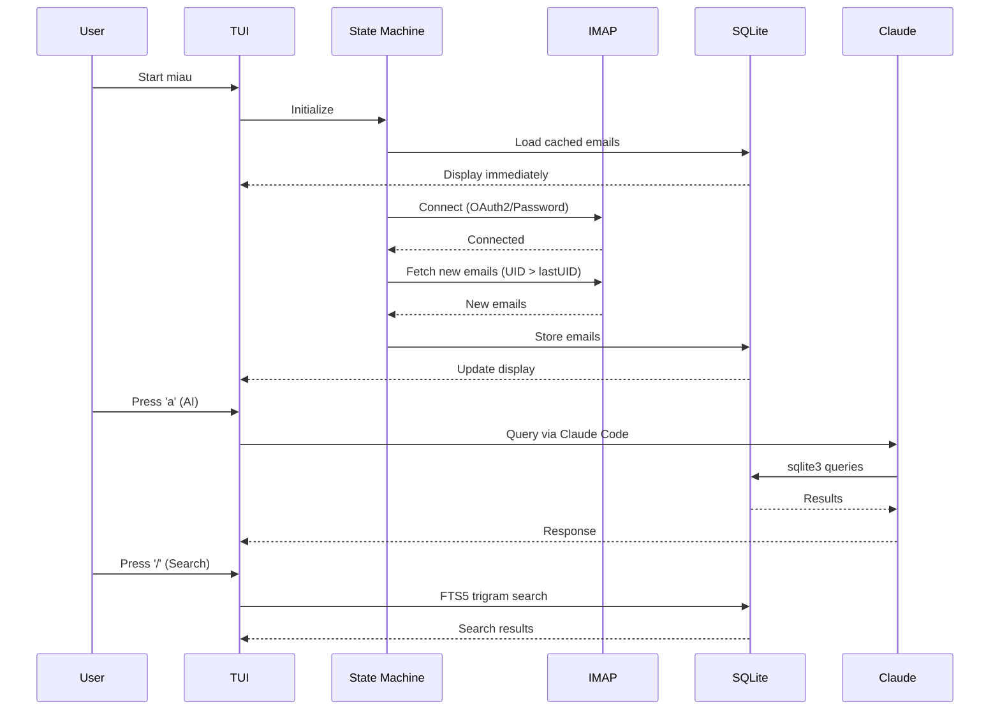
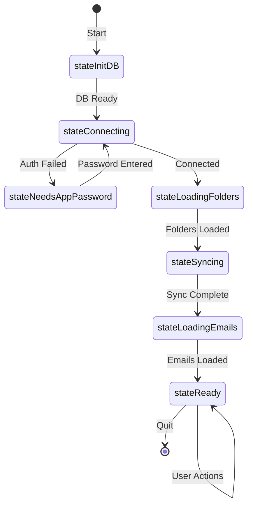

# miau Architecture

## System Overview

The application uses a layered architecture that separates UI from business logic,
enabling multiple interfaces (TUI, Web, Desktop) to share the same core.

```mermaid
graph TB
    subgraph "User Interfaces"
        TUI[Terminal UI<br/>Bubble Tea]
        WEB[Web App<br/>Go + HTMX<br/>(future)]
        DESKTOP[Desktop App<br/>Wails/Fyne<br/>(future)]
        CLI[CLI Commands<br/>miau, miau auth]
    end

    subgraph "Application Core (internal/app)"
        APP[Application<br/>Wires everything]
    end

    subgraph "Ports (internal/ports)"
        IEMAILSVC[EmailService]
        ISENDSVC[SendService]
        IDRAFTSVC[DraftService]
        ISEARCHSVC[SearchService]
        IBATCHSVC[BatchService]
        INOTIFYSVC[NotificationService]
        ISYNCSVC[SyncService]
        IEVENTBUS[EventBus]
    end

    subgraph "Services (internal/services)"
        EMAILSVC[EmailService]
        SENDSVC[SendService]
        DRAFTSVC[DraftService]
        SEARCHSVC[SearchService]
        BATCHSVC[BatchService]
        NOTIFYSVC[NotificationService]
        SYNCSVC[SyncService]
        EVENTBUS[EventBus]
    end

    subgraph "Adapters (internal/adapters)"
        IMAPADAPTER[IMAPAdapter]
        STORAGEADAPTER[StorageAdapter]
    end

    subgraph "Infrastructure"
        IMAP[IMAP Client<br/>go-imap/v2]
        SMTP[SMTP Client<br/>net/smtp]
        GMAIL[Gmail API<br/>REST Client]
        STORAGE[Storage<br/>SQLite + FTS5]
        AUTH[OAuth2 Manager]
        CONFIG[Config<br/>Viper/YAML]
    end

    subgraph "External Services"
        IMAP_SERVER[IMAP Server]
        SMTP_SERVER[SMTP Server]
        GMAIL_API[Gmail API]
        CLAUDE[Claude Code<br/>AI Assistant]
    end

    TUI --> APP
    WEB --> APP
    DESKTOP --> APP
    CLI --> AUTH

    APP --> IEMAILSVC
    APP --> ISENDSVC
    APP --> IDRAFTSVC
    APP --> ISEARCHSVC
    APP --> IBATCHSVC
    APP --> INOTIFYSVC
    APP --> ISYNCSVC
    APP --> IEVENTBUS

    EMAILSVC -.-> IEMAILSVC
    SENDSVC -.-> ISENDSVC
    DRAFTSVC -.-> IDRAFTSVC
    SEARCHSVC -.-> ISEARCHSVC
    BATCHSVC -.-> IBATCHSVC
    NOTIFYSVC -.-> INOTIFYSVC
    SYNCSVC -.-> ISYNCSVC
    EVENTBUS -.-> IEVENTBUS

    EMAILSVC --> IMAPADAPTER
    EMAILSVC --> STORAGEADAPTER
    SYNCSVC --> IMAPADAPTER
    SYNCSVC --> STORAGEADAPTER

    IMAPADAPTER --> IMAP
    STORAGEADAPTER --> STORAGE

    IMAP --> IMAP_SERVER
    SMTP --> SMTP_SERVER
    GMAIL --> GMAIL_API
    AUTH --> GMAIL_API
```

## Layered Architecture

### 1. Ports Layer (`internal/ports/`)
Defines interfaces that abstract all functionality:
- **EmailService** - Email CRUD operations
- **SendService** - Email sending via SMTP or Gmail API
- **DraftService** - Draft management
- **SearchService** - Full-text search
- **BatchService** - Batch operations
- **NotificationService** - Bounce detection and alerts
- **SyncService** - IMAP synchronization
- **EventBus** - Event-based communication

### 2. Services Layer (`internal/services/`)
Implements business logic using ports interfaces:
- Pure Go, no UI dependencies
- Testable with mock adapters
- Coordinates between adapters

### 3. Adapters Layer (`internal/adapters/`)
Implements port interfaces using existing infrastructure:
- **IMAPAdapter** - Wraps `internal/imap`
- **StorageAdapter** - Wraps `internal/storage`

### 4. Application Core (`internal/app/`)
Wires everything together:
- Creates adapters
- Creates services
- Provides unified API for UIs

### 5. Email Parser (`internal/email/`)
Extracted MIME parsing utilities:
- Text/HTML extraction
- Attachment handling
- Bounce detection

## Data Flow



## Package Structure

```
internal/
├── app/                 # Application core
│   └── app.go           # Wires services + adapters
│
├── ports/               # Interface definitions
│   ├── app.go           # App interface
│   ├── email.go         # EmailService, SendService, etc.
│   ├── events.go        # EventBus, Event types
│   ├── storage.go       # StoragePort, IMAPPort
│   └── types.go         # Shared types
│
├── services/            # Business logic
│   ├── batch.go         # Batch operations
│   ├── draft.go         # Draft management
│   ├── email.go         # Email operations
│   ├── eventbus.go      # Event bus implementation
│   ├── notification.go  # Bounce detection, alerts
│   ├── search.go        # Full-text search
│   ├── send.go          # Email sending
│   └── sync.go          # IMAP synchronization
│
├── adapters/            # Port implementations
│   ├── errors.go        # Adapter errors
│   ├── imap.go          # IMAP adapter
│   └── storage.go       # Storage adapter
│
├── email/               # Email parsing utilities
│   ├── bounce.go        # Bounce detection
│   └── parser.go        # MIME parsing
│
├── tui/                 # Terminal UI (Bubble Tea)
│   ├── inbox/           # Main inbox interface
│   └── setup/           # First-run wizard
│
├── imap/                # IMAP client (go-imap/v2)
├── smtp/                # SMTP client
├── gmail/               # Gmail REST API
├── auth/                # OAuth2 authentication
├── storage/             # SQLite + FTS5
├── config/              # Viper configuration
└── image/               # Terminal image rendering
```

## Component Responsibilities

### Ports Layer (`internal/ports/`)
Defines contracts for all services:
- **EmailService** - Get, list, mark as read, archive, delete
- **SendService** - Send email via SMTP or Gmail API
- **DraftService** - Create, update, schedule drafts
- **SearchService** - Full-text search with FTS5
- **BatchService** - Batch archive/delete operations
- **NotificationService** - Bounce detection, alerts
- **SyncService** - IMAP connection and sync
- **EventBus** - Publish/subscribe events

### Services Layer (`internal/services/`)
Implements business logic:
- No UI dependencies
- Uses adapters for infrastructure
- Publishes events for UI updates

### Adapters Layer (`internal/adapters/`)
Connects services to infrastructure:
- **IMAPAdapter** - Wraps `internal/imap` client
- **StorageAdapter** - Wraps `internal/storage` repository

### TUI Layer (`internal/tui/`)
- **inbox/** - Main email interface with state machine
- **setup/** - First-run configuration wizard

### Infrastructure (`internal/`)
- **imap/** - IMAP protocol wrapper (go-imap/v2)
- **smtp/** - Email sending via SMTP
- **gmail/** - Gmail REST API client
- **auth/** - OAuth2 authentication flow
- **storage/** - SQLite + FTS5 database
- **config/** - YAML configuration via Viper

## State Machine Flow



## Technology Stack

| Component | Technology | Purpose |
|-----------|------------|---------|
| TUI Framework | Bubble Tea + Lip Gloss | Terminal UI rendering |
| Database | SQLite (modernc.org) | Local email storage |
| Full-text Search | FTS5 + Trigram | Fuzzy email search |
| IMAP Client | go-imap/v2 | Email retrieval |
| SMTP Client | net/smtp | Email sending |
| Gmail API | REST + OAuth2 | Gmail integration |
| Config | Viper | YAML configuration |
| AI Integration | Claude Code | Natural language queries |
