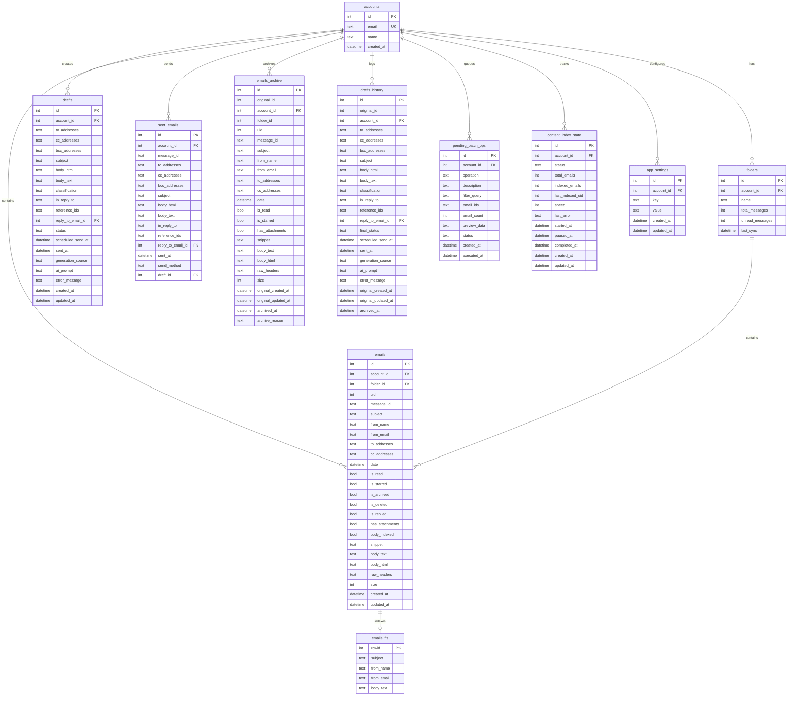
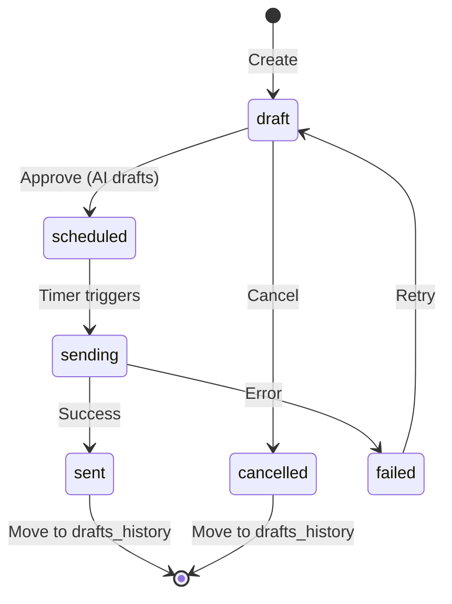

# miau Database Schema

## Entity Relationship Diagram



## Table Descriptions

### Core Tables

| Table | Purpose |
|-------|---------|
| `accounts` | User email accounts |
| `folders` | IMAP folders/labels |
| `emails` | Email messages (cached from IMAP) |
| `emails_fts` | Full-text search index (FTS5 trigram) |

### Composition & Sending

| Table | Purpose |
|-------|---------|
| `drafts` | Draft emails awaiting send |
| `sent_emails` | Permanent record of sent emails |

### Archive Tables (Permanent Storage)

| Table | Purpose |
|-------|---------|
| `emails_archive` | Archived emails (after server deletion) |
| `drafts_history` | Historical draft records |

### Operations & State

| Table | Purpose |
|-------|---------|
| `pending_batch_ops` | Queued bulk operations with preview |
| `content_index_state` | Background indexer progress |
| `app_settings` | Per-account settings |

## Key Indexes

```sql
-- Email retrieval
idx_emails_account_folder ON emails(account_id, folder_id)
idx_emails_date ON emails(date DESC)
idx_emails_from ON emails(from_email)
idx_emails_subject ON emails(subject)
idx_emails_is_read ON emails(is_read)
idx_emails_is_archived ON emails(is_archived)
idx_emails_body_indexed ON emails(body_indexed)

-- Drafts
idx_drafts_account_status ON drafts(account_id, status)
idx_drafts_scheduled ON drafts(status, scheduled_send_at)

-- Archive
idx_emails_archive_account ON emails_archive(account_id)
idx_emails_archive_date ON emails_archive(date DESC)
idx_emails_archive_from ON emails_archive(from_email)

-- Operations
idx_pending_batch_ops_status ON pending_batch_ops(account_id, status)
idx_app_settings_account_key ON app_settings(account_id, key)
```

## FTS5 Full-Text Search

The `emails_fts` virtual table uses **trigram tokenization** for fuzzy partial matching:

```sql
CREATE VIRTUAL TABLE emails_fts USING fts5(
    subject,
    from_name,
    from_email,
    body_text,
    content='emails',
    content_rowid='id',
    tokenize='trigram'
);
```

**Features:**
- Partial word matching (e.g., "inv" matches "invoice")
- Case-insensitive search
- Multi-field search (subject, from, body)
- Auto-sync via triggers

**Example Queries:**
```sql
-- Fuzzy search
SELECT * FROM emails_fts WHERE emails_fts MATCH 'invoice';

-- With email metadata
SELECT e.* FROM emails e
JOIN emails_fts fts ON e.id = fts.rowid
WHERE emails_fts MATCH 'newsletter' AND e.is_deleted = 0;
```

## Soft Delete Strategy

miau never hard-deletes data:

| Flag | Meaning | Recovery |
|------|---------|----------|
| `is_archived` | Hidden from inbox, kept in DB | Toggle back |
| `is_deleted` | In trash, pending archive | Restore within 30 days |
| `emails_archive` | Permanently archived | Search archive table |

## Draft Status Flow



## Data Retention Policy

| Data Type | Retention | Storage |
|-----------|-----------|---------|
| Active emails | Synced with server | `emails` |
| Deleted by server | Permanent | `emails_archive` |
| User-deleted | 30 days → archive | `emails` → `emails_archive` |
| Sent emails | Permanent | `sent_emails` |
| Drafts | Until sent/cancelled | `drafts` → `drafts_history` |
